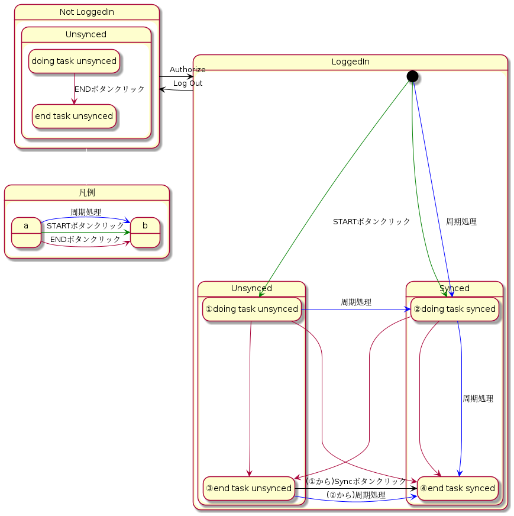
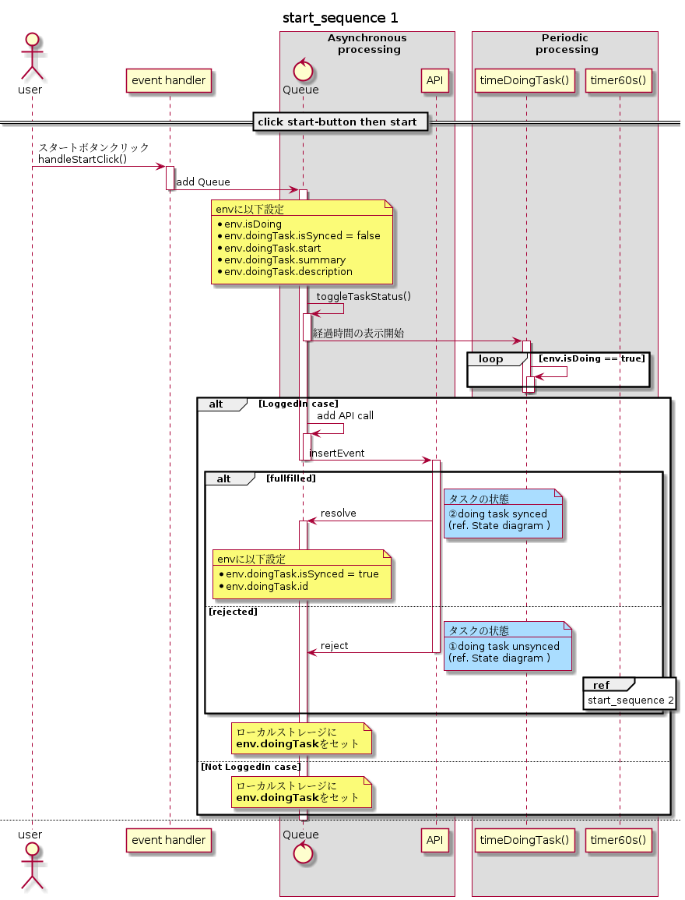
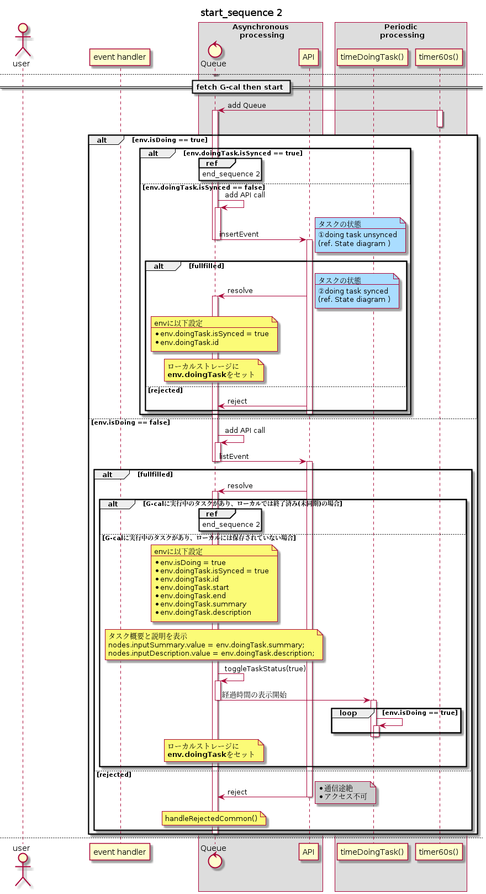
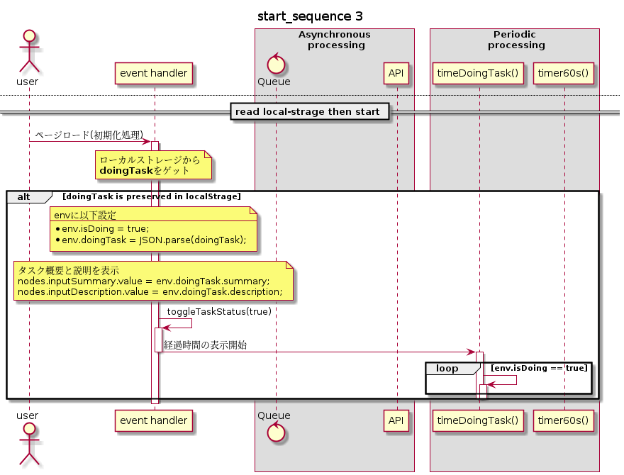
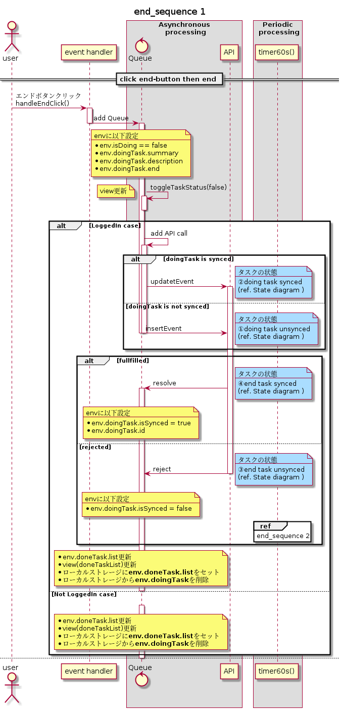

## State diagram
タスクの遷移パターン
| No. | Summary       |                                                              |
| --- | ------------- | ------------------------------------------------------------ |
| 1   | ② → ④         | 正常系                                                       |
| 2   | ② → ③ → ④     | 同期スタート・非同期エンド、周期処理で同期                   |
| 3   | ① → ② → ④     | 非同期スタート、周期処理で同期・同期エンド                   |
| 4   | ① → ② → ③ → ④ | 非同期スタート、周期処理で同期・非同期エンド、周期処理で同期 |
| 5   | ① → ④         | 非同期スタート・同期エンド                                   |
| 6   | ① → ③ → ④     | 非同期スタート・非同期エンド、ユーザアクションで同期         |

## Sequence diagram
### start sequence
#### 1. click start-button

##### 処理
- グローバルオブジェクトの更新
- viewの更新
- API call
- ローカルストレージにdoingTaskをセット

##### タスクの状態
APIの応答によって以下のいずれかとなる。
- ①Unsynced
- ②Synced

#### 2. fetch doingTask in G-cal
##### 処理
- ローカルで未同期の実行中タスクをG-calに同期する
  - タスクの状態: ① → ②
- G-calから実行中タスクを取得する
  - タスクの状態: ②

#### 3. read local-strage
##### 処理
- グローバルオブジェクトの更新
- viewの更新

##### タスクの状態
保存されたタスクの状態によって以下のいずれかとなる。
- ①Unsynced
- ②Synced

### end sequence
#### 1. click end-button

##### 処理
- グローバルオブジェクト(doingTask)の更新
- viewの更新
- API call
- グローバルオブジェクト(doneTask)の更新
- viewの更新(doneTaskList)
- ローカルストレージからdoingTaskを削除
- ローカルストレージにdoneTaskをセット

##### タスクの状態
実行中のタスクの状態、APIの応答によって以下のいずれかとなる。(ref. state diagram)
- ① → ③
- ① → ④
- ② → ③
- ② → ④

※同期済み実行中タスクが非同期で終了された場合(② → ③)は周期処理で同期を試みる。(ref. [2. fetch doneTask in G-cal](#2-fetch-donetask-in-g-cal))

#### 2. fetch doneTask in G-cal
##### 処理
- ローカルで実行中のタスクが他IFから終了されていないか確認する
  - タスクの状態：② → ④
- ローカルで終了済み(未同期)のタスクをG-calに同期する
  - タスクの状態：③ → ④

| table      | table    | table                                                       | 実装  | check | 観点                   | memo                         |
| ---------- | -------- | ----------------------------------------------------------- | :---: | :---: | ---------------------- | ---------------------------- |
| -          | normal   | ログイン→カレンダー変更→スタート→終了                       |   o   |   x   | row                    | row                          |
| -          | abnormal | カレンダー変更→Gカレ上でカレンダー削除                      |   o   |   x   | 周期処理で通知出す     | row                          |
| initialize | normal   | 終了済みタスクの表示                                        |   x   |  row  | row                    | 同期できなかったタスクの表示 |
| start task | abnormal | スタート → エラー条件発生                                   |   o   |  row  | 周期処理で通知         | row                          |
| start task | abnormal | エラー条件 → スタート → エラー条件解消                      |   o   |  row  | 周期処理で同期         | row                          |
| done task  | abnormal | エラー条件 → スタート → エラー条件解消 → 周期処理前にエンド |   o   |  row  |                        | row                          |
| end task   | abnormal | エラー条件 → スタート → 終了                                |   x   |  row  | 未同期ステータスで終了 | row                          |
| row        | row      | row                                                         |  row  |  row  | row                    | row                          |
| row        | row      | row                                                         |  row  |  row  | row                    | row                          |
| row        | row      | row                                                         |  row  |  row  | row                    | row                          |
| row        | row      | row                                                         |  row  |  row  | row                    | row                          |